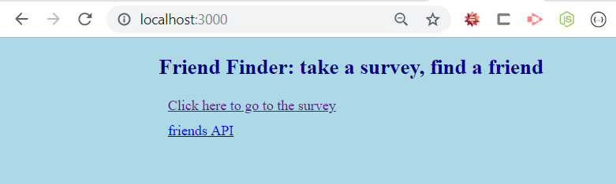

# FriendFinder

A compatibility based friend finder.

## Description

This basic application provides a survey of 10 questions to determine who you are most compatible with.

The purpose of this application was to test and experiment with Express routes.

If you would like to check out this simple application, then click on the link below.

### [Friend Finder](https://friend-finder-arw.herokuapp.com/)

## Instructions

You will need to first clone this repo (you will need to install [git](https://git-scm.com/) to do this).

```
// cloning with ssh
git clone git@github.com:RexStrider/FriendFinder.git

// cloning with https
git clone https://github.com/RexStrider/FriendFinder.git
```

Then you will need to install the node dependencies.

Navigate to the root directory of this project using a command line interface and enter the following command (you will need [node](https://nodejs.org/en/download/) installed to do this).

```
npm install
```

Once the previous steps are completed, you can run the application using the following command (make sure you are in the root directory of the project, or it won't work!).

```
node server.js
```

You should see a message in your CLI indicating the application has started.


After you see this message, go to your browser and enter localhost:3000 into the URL field



and that's all there is to it.

## Technology

 - Node JS
 - Express
 - JavaScript
 - HTML
 - CSS
